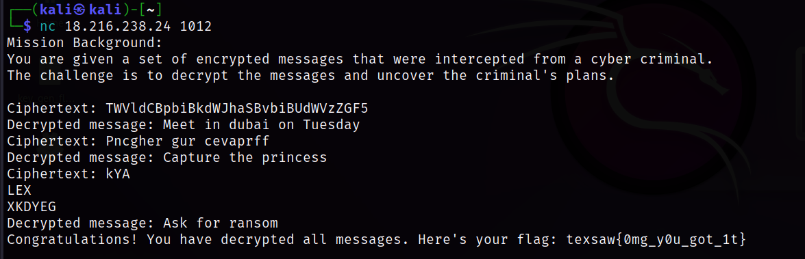

# Crack the Crime
- Solves - 42
- Points - 100
#
# Description
Your mission is to decrypt a set of messages and uncover the plans of the criminal

nc 18.216.238.24 1012

Hint: The third cipher can be decrypted in cyberchef.
# Attachments

# Solution

There are three assignments to solve.

1. Base64 string
2. ROT13
3. a little harder, but the clue says CyberChef can solve it for us, so just pass him the condition and let him use some magic

